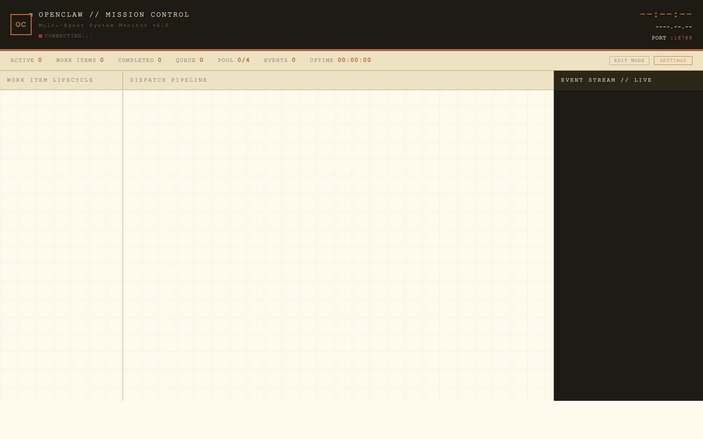

<div align="center">

# MulitAgent-OpenClaw-System-kksl

**一个基于Openclaw Agent 为基底的协作平台**

_代码控制流程，LLM 负责内容_

[](https://github.com/Hakens12025/openclaw-multiagent)
[](https://github.com/Hakens12025/openclaw-multiagent)
[](https://github.com/Hakens12025/openclaw-multiagent)
[](https://nodejs.org/)
[](https://github.com/Hakens12025/openclaw-multiagent)
[](https://github.com/Hakens12025/openclaw-multiagent/commits/main)

[核心理念](#-核心理念) • [它能干嘛](#-它能干嘛) • [架构](#️-架构) • [快速开始](#-快速开始) • [文档](#-文档地图)

</div>

---

## 🚧 项目状态：半成品（WIP）

> 这不是一个成熟的产品，而是一个**持续演进中的个人研究项目**。
>
> - 核心（inbox/outbox + graph-driven dispatch）**可用且稳定**
> - Watchdog 编排、并发 worker 池、研究回路、Dashboard **可用**
> - 仅在 macOS 环境日常使用，其他平台未做兼容性验证
>
> - 想在生产环境部署的同学请慎重，工业有效是该系统的理想状态，也是最初方向。想一起玩 Agent 架构实验的欢迎 Star / Fork / 提 Issue。

---

## 💡 核心理念

OpenClaw 的所有设计都围绕一条第一原则展开：

> **LLM 负责内容，代码负责流程。**

| 代码硬路径（必须确定） | LLM 软路径（允许模糊） |
|---|---|
| 路由（inbox/outbox、delivery） | 任务理解与拆解 |
| 状态机（contract、graph pipeline/loop） | 代码/分析产出 |
| 调度（传送带 dispatch、排队、唤醒） | 自然语言回复 |
| 安全（before_tool_call、敏感信息拦截） | 实验结论解释 |
| 质量门控（阈值判定、阶段迁移） | — |

### 🏭 信息分发原则（Conveyor Belt）

**绝对禁止在回路里硬编码 agent 名称或角色特化分支。**
这样一来，换一个 agent 就是换一个 JSON 配置，不用改一行平台代码。


### 🤐 Agent-系统交互最小化

Agent 写**内容**，系统提取**结构** —— **不是**让 Agent 写 JSON 驱动系统。

系统从可观察信号（文件写入、工具调用、执行轨迹、自然语言标记）提取状态，**不信任 Agent 自报**：


### 🎭 SOUL 是通用机，不是专用机

每个 Agent 的 `SOUL.md` 只写通用行为（状态机、inbox/outbox 流程、生命周期），**领域知识全部通过 skill 注入**。

换一个领域 = 换一套 skill，SOUL 一字不改。这是"通用机"而非"专用机"的本质。


### 👑 消除 God Role

系统**只有两种结构角色**：`bridge`（外部入口）与 `worker`（执行单元）。


### 🕸️ Graph 是运行时真值，不是 UI 装饰

`COLLABORATION-GRAPH.md` 定义的 agent 协作边是**强制执行的授权**：

修拓扑不是改代码，是改 graph 描述文件（或在 Dashboard Edit Mode 里拖）。

### 💰 Token Economy（为什么"小模型友好"）

LLM 每次唤醒都要**重新支付全部上下文 token 成本**（1 KB ≈ 250 tokens）。系统通过以下手段把成本压到底：

- **Workspace 瘦身**：执行类 agent 只注入 `SOUL + HEARTBEAT`，不塞通用教程
- **角色差异化注入**：`workspace-guidance-writer` 按角色生成文件；planner 拿规划知识、worker 拿执行知识，不串
- **Skill 按需装配**：agent 只加载配置里列出的 skill，不全量加载
- **连接面最小化**：Agent 需要懂的系统协议越少，注入 token 越少

效果：**默认模型是 MiniMax M2.5 这种中等开销模型**，非 Claude Opus / GPT-4 级也能稳定跑完整链路。需要更强模型时通过 [`model-switcher`](skills/model-switcher/SKILL.md) skill 按任务切换（写代码 → Doubao Seed Code、长文分析 → Kimi K2.5、复杂推理 → DeepSeek V3.2……）。

### 🛡️ 防御纵深（Defense in Depth）

不依赖单一机制保证安全，多层兜底：

| 层 | 机制 | 粒度 |
|---|---|---|
| 结构层 | Graph edge 授权 | 谁能投给谁 |
| 工具层 | `before_tool_call` hook | 拦截任意工具调用 |
| Agent 层 | `tools.allow` / `.deny` | 粒度到每个 agent |
| 内容层 | 敏感信息拦截 hook | 扫描输入/输出内容 |

每层独立生效，一层失守后面继续拦。

---

## 🧠 Harness — 执行层的拼图（Jigsaw）

Harness 是**执行层工具箱**，不是平台总控。它存在的理由只有一句话：

> **让一次执行可限制、可采证、让上层吃到统一的 `HarnessRun`。**

### 极简对象集（当前只允许持有 3 类正式对象）

| 对象 | 作用 |
|---|---|
| `HarnessSelection` | 本次执行选中哪些 module |
| `HarnessRun` | 一次执行的完整轨迹（谁、跑了啥、产出了啥、用了多少 token） |
| `HarnessModuleResult` | 单个 module 的产出 |

多一个对象都要先问"它真的不是这三个之一吗"。对象集膨胀 = 概念蔓延。

### 4 种 active module kind（多一种都没有）

| Kind | 作用 |
|---|---|
| `guard` | 预算 / 工具 / 作用域限制 |
| `collector` | artifact / trace 采集 |
| `gate` | 完成 / 验证门控 |
| `normalizer` | evaluator 输入与失败归一化 |

新需求来先问："能不能组合现有 kind 解决？"不能才考虑新 kind。

### Jigsaw 精神：拒绝 Mega Orchestrator

Harness 选择**拼图式组合**而非"一个全能大脑"：

- 每块拼图只干一件事，可独立测试、可独立替换
- 一次执行按需**选中几块拼图拼起来**，没选的不加载
- 宁可多几个小 module，不要一个 mega-module 包打天下
- **"让 harness 更大"不是目标**，"让执行可限可证"才是目标

### 明确的边界：Harness 不做的事

Harness **不定义**：

- ❌ 谁与谁协作 → 那是 **Graph** 的事
- ❌ 合约回给谁 → 那是 **Delivery** 的事
- ❌ Loop 是否继续 → 那是 **Loop-session / Evaluator** 的事
- ❌ 模式如何结晶为稳定能力 → 那是 **Automation of Automation** 的事

每一层只对自己那一格负责。权责混淆 = 大泥球。

### 在系统里的位置

```
                Automation of Automation
                          ▲
                          │ 消费 HarnessRun
                          │ 产出 AutomationDecision
                          │
                       Harness  ◀──── 平行：Graph / Loop / Delivery
                          ▲
                          │ 观察工具调用、文件写入
                          │
                     Agent 执行
```

详见 [`wiki/concepts/harness.md`](wiki/concepts/harness.md) — 当前状态：**设计方向稳定、接口冻结中**。

---

## 🎯 它能干嘛

### 1. 多渠道消息接入 → 自动分流 → 并发执行 → 自动交付

```
用户消息 (WebUI / QQ Bot / 飞书 / API)
    ↓
Bridge agent（网关桥接）
    ↓
Ingress 分类（simple / standard）
    ↓
Fast-track 直接执行  ‖  Contractor 规划 → Worker Pool 并发执行
    ↓
Evaluator 评估 ‖ Researcher 研究 ‖ 直接交付
    ↓
Delivery 统一回传给用户
```

### 2. 研究回路（Research Loop）

一个典型的多 agent 协作闭环，平台代码驱动，LLM 只做思考：

```
Planner → 拆解检索方向
    ↓
Researcher → web_search / web_fetch → 搜集
    ↓
Worker → 分析 / 整合 / 产出
    ↓
Evaluator → 质量判定 → 阈值未达？再回一轮
    ↓
Conclude → 结论交付
```

回路由 `graph-loop-registry` + `loop-session` 驱动，stage 阈值不达标自动重试。

### 3. 支持的能力矩阵

| 维度 | 能力 | 位置 |
|---|---|---|
| **消息渠道** | WebUI、QQ 官方 Bot、飞书、A2A | `extensions/qqbot/`, `bindings` |
| **模型供应商** | ARK (豆包/MiniMax/GLM/DeepSeek/Kimi)、OpenAI 兼容、Anthropic Messages、本地 Ollama | `openclaw.json → models.providers` |
| **Agent 角色** | bridge / planner / executor / researcher / evaluator | `openclaw.json → agents.list` |
| **并发调度** | Worker Pool（默认 6 路并发） | `lib/worker-pool.js` |
| **协议原语** | direct_request / execution_contract / workflow_signal | `lib/protocol-primitives.js` |
| **Outbox Kind** | execution_result / research_search_space / evaluation_verdict | `lib/router-handler-registry.js` |
| **工具** | read/write/edit、web_search、web_fetch、agent-to-agent、system_action | `openclaw.json → tools`, `skills/system-action/` |
| **Skill 注入** | 运行时可配置，按 agent 粒度开关 | `skills/`, `agents.list[].skills` |
| **Hook 扩展** | session_start, message_received, before_tool_call, after_tool_call, agent_end... | `extensions/watchdog/hooks/` |
| **Dashboard** | SVG 交互拓扑、实时 graph、pipeline/loop 运行时监控 | `extensions/watchdog/dashboard-*.js` |
| **测试套件** | test-runner.js 单一入口 + 7 种预设 | `extensions/watchdog/test-runner.js` |
| **安全闸** | before_tool_call 可阻断工具调用、敏感信息拦截、工具白/黑名单 | `hooks/before-tool-call.js` |

### 4. 典型使用场景

- **个人 AI 工作台**：把多模型、多能力封装成一个带持久记忆与协作能力的入口
- **IM 机器人后端**：QQ / 飞书消息自动分流到合适的 agent 处理
- **研究代理**：发起一个研究话题 → 自动检索 → 整理 → 评估 → 产出报告
- **自动化流水线**：把"规划→执行→评估"的工作流固化成 graph，而不是每次手写 prompt 链
- **Agent 框架实验**：作为研究 Agent 架构（协议、调度、评估）的沙盒

---

## 🏗️ 架构

```
┌─ Gateway Layer ──────────────────────────────────┐
│ openclaw gateway run                             │
│     ↓ 加载 openclaw.json                         │
│     ↓ 注册 plugins: watchdog, qqbot, feishu      │
└──────────────────┬───────────────────────────────┘
                   │ hook events
┌──────────────────▼───────────────────────────────┐
│  WATCHDOG PLUGIN (extensions/watchdog/)          │
│                                                   │
│  Hooks          Routes           Lib (核心逻辑)    │
│  ──────         ──────           ─────────────    │
│  ingress        api              agent-identity   │
│  tool-call      dashboard        protocol-prims   │
│  agent-end      operator         router-handler   │
│                 a2a              worker-pool      │
│                 test-runs        pipeline/loops   │
│                                                   │
│  ↓ 消息流转                                       │
│                                                   │
│  fast-track  │  contractor  │  research-loop      │
│  bridge      │  planner     │  researcher →       │
│    ↓         │    ↓         │  worker →           │
│  executor    │  worker-pool │  evaluator          │
│    ↓         │    ↓         │    ↓                │
│  delivery    │  delivery    │  conclude           │
└──────────────────┬───────────────────────────────┘
                   │ inbox / outbox / system_action
┌──────────────────▼───────────────────────────────┐
│  AGENT LAYER (workspaces/<agentId>/)              │
│                                                   │
│  每个 agent 独立目录：                             │
│  ├── SOUL.md              角色定义                │
│  ├── HEARTBEAT.md         一句话转发              │
│  ├── inbox/               平台投递                │
│  │   └── contract.json    当前任务                │
│  └── outbox/              agent 产出              │
│      ├── contract_result.json                    │
│      └── system_action.json                      │
│                                                   │
│  Agent 只看到文件协议，完全不感知 watchdog 代码    │
└───────────────────────────────────────────────────┘
```

---

## 🖥️ Dashboard — 前端怎么用



> ☝️ 上图是 Gateway 刚启动、WebSocket 尚未握手时的初始界面（`CONNECTING...`），展示 UI 骨架。
> 真实运行中，中间面板会有 agent 节点、消息沿 graph 边流动，右侧事件流实时滚动，统计栏数字变化。

### 访问

```
http://localhost:18789/watchdog/progress?token=<gateway.auth.token>
```

Token 取自 `openclaw.json → gateway.auth.token`。


### 三大主面板

| 面板 | 位置 | 功能 |
|---|---|---|
| **WORK ITEM LIFECYCLE** | 左 | 合约生命周期列表：谁在做什么、当前阶段、状态 |
| **DISPATCH PIPELINE** | 中 | 实时 SVG graph 拓扑 + 消息流动可视化 |
| **EVENT STREAM // LIVE** | 右 | 事件流滚动：inbox 投递 / outbox 提交 / wake / end / tool call… |

### 顶部状态条

`ACTIVE` · `WORK ITEMS` · `COMPLETED` · `QUEUE` · `POOL x/n` · `EVENTS` · `UPTIME`
每项都是系统真实状态的实时投影，不是定时刷新的快照。

### EDIT MODE / SETTINGS

- **EDIT MODE** — 直接在 Dashboard 上**拖 agent 节点、加/删 edge、切 agent 模型**。改动通过 Admin Change Sets 持久化，可预览、可回滚
- **SETTINGS → RUNTIME OPERATOR** — 打开 Operator 浮窗，手动触发 `wake` / `assign` / `force-complete` 等运维动作
- **SETTINGS → TEST TOOLS** — 打开 Devtools 面板，直接跑 test-runner 预设、看 change-set 历史、审 test-runs 报告

### 子页（通过顶部 nav-bar 访问）

- `/watchdog/agents` — Agent 详情页（配置、近期事件、工具调用轨迹）
- Harness Atlas — Harness module 选择与 Run 历史
- Operator Catalog — 可用运维动作目录
- Flow Protocols — 协议流线查看

### 典型使用流程

1. `bash ~/.openclaw/start.sh` → 打开 Dashboard → 连接状态由 `CONNECTING...` 变成 `ONLINE`
2. 从 WebUI / QQ Bot / 飞书 发消息 → 左面板出现新 work item
3. 中间面板：对应 agent 节点被唤醒，消息沿 graph edge 流动
4. 右面板事件流滚动每一次 tool call / inbox deliver / outbox commit
5. 完成后 work item 变 `COMPLETED`，POOL 计数回落
6. 出问题？→ `SETTINGS → TEST TOOLS → TEST RUNS` 看最新一次测试报告

---

## 🛠️ 技术栈

| 层 | 技术 |
|---|---|
| Runtime | Node.js 22+ |
| Gateway | `openclaw` CLI（独立 npm 包） |
| Plugins | JavaScript / TypeScript |
| Dashboard | 原生 HTML/CSS/JS（零框架，NASA-Punk 风格） |
| Agent 协议 | 文件系统（inbox/outbox）+ JSON manifest |
| Skills | Markdown 描述 + 可选 Python/Shell 脚本 |
| 测试 | `test-runner.js` 自研驱动 + test-reports 产物审计 |

---

## 🚀 快速开始

### 前置条件

- macOS（当前维护环境，Linux/Windows 未测试）
- Node.js 22+
- `openclaw` CLI

```bash
npm install -g openclaw
```

### Clone & Configure

```bash
git clone https://github.com/Hakens12025/openclaw-multiagent.git ~/.openclaw
cd ~/.openclaw

# 1. 复制配置模板并填入真实密钥
cp openclaw.example.json openclaw.json
```

编辑 `openclaw.json`，至少填入：

- `models.providers.*.apiKey` — 模型 API Key（推荐 ARK 聚合）
- `gateway.auth.token` — 建议随机生成 48 位 hex
- `channels.*` — 可选，仅当需要接入 QQ/飞书时填

```bash
# 2. 初始化
bash setup.sh
openclaw configure
```

### 运行

```bash
# 后台（推荐，含 SSH 隧道 + Gateway）
bash ~/.openclaw/start.sh

# 前台
openclaw gateway run
```

常用地址：

- **WebUI**: `http://localhost:18789`
- **Dashboard**: `http://localhost:18789/watchdog/progress?token=<gateway.auth.token>`

---

## 📁 项目结构

```
.
├── SYSTEM_MAP.md                   # ★ 零上下文 10 分钟接手入口
├── CLAUDE.md                       # 项目总纲 / 开发规范
├── CODEX.md                        # Codex 执行手册
├── openclaw.example.json           # 主配置模板（密钥已脱敏）
├── profiles/                       # 部署 profile（端口、地址可覆盖）
│
├── extensions/                     # 源码 — 插件
│   ├── watchdog/                   #   核心编排（lib/ hooks/ routes/ domains/ tests/）
│   └── qqbot/                      #   QQ 渠道接入
├── skills/                         # 源码 — 运行时可注入技能
│   ├── multi-agent-comm/           #   多 agent 通讯协议
│   ├── research-methodology/       #   研究方法论
│   ├── operator-admin/             #   运维操作
│   ├── system-action/              #   平台动作
│   └── ...                         #   ~20 个 skill
├── scripts/                        # 源码 — 辅助脚本
├── docs/                           # 设计文档 + 迭代计划归档
│
├── wiki/                           # LLM Wiki（概念/决策/索引）
│   ├── index.md                    #   导航入口
│   ├── concepts/                   #   核心概念解释
│   └── decisions/                  #   架构决策记录
│
├── start.sh / setup.sh / clean.sh  # 运维脚本
├── ssh-tunnel.sh                   # SSH 隧道（QQ Bot 反向代理）
└── benchmark.js                    # 基准测试
```

**运行态目录**（`workspaces/`, `research-lab/`, `test-reports/`, `memory/`, `logs/`, `delivery-queue/`）由 Gateway 启动时自动创建，不纳入版本控制。

---

## 🧪 测试

**唯一入口**：`test-runner.js`（禁止手写 curl 假装链路测试）

```bash
cd ~/.openclaw/extensions/watchdog

# 基础链路
node test-runner.js --preset single

# 并发
node test-runner.js --preset concurrent

# graph / pipeline / loop
node test-runner.js --preset loop-basic
node test-runner.js --preset loop-control

# 研究回路
node test-runner.js --preset research-flow

# 精细控制
node test-runner.js --suite single --filter "你好"
node test-runner.js --suite benchmark
```

报告输出：`~/.openclaw/test-reports/`

---

## 📚 文档地图

新接手的同学建议按此顺序读：

1. **[`SYSTEM_MAP.md`](SYSTEM_MAP.md)** — 10 分钟系统全貌（**从这里开始**）
2. **[`CLAUDE.md`](CLAUDE.md)** — 项目总纲（硬约束、代码红线、传送带原则）
3. **[`openclaw.example.json`](openclaw.example.json)** — 配置清单
4. **[`wiki/index.md`](wiki/index.md)** — 概念与决策索引
5. **[`extensions/watchdog/index.js`](extensions/watchdog/index.js)** — 插件装配入口

重点设计决策：

- [硬路径 vs 软路径](wiki/concepts/hard-soft-path.md) — 第一原则
- [传送带原则](wiki/concepts/conveyor-belt.md) — 唯一 transport 原语
- [Graph 作为运行时真值](wiki/decisions/graph-as-runtime-truth.md) — 权限与路由
- [SOUL 作为通用机](wiki/decisions/soul-as-generic-machine.md) — agent 通用化
- [Pipeline 溶解](wiki/decisions/pipeline-dissolution.md) — 删除 1717 行的大重构
- [God Role 消除](wiki/decisions/god-role-elimination.md) — 只留 bridge + worker

---

## 📍 Maybe TODO（可能会做）

> 这是"想做，但还没动手 / 还在设计 / 还没跑通"的清单。不承诺时间，不承诺做不做，纯粹写给自己看。

### 🔧 更多 Harness Modules

当前 Harness 只有 4 种 active module kind：

| Kind | 作用 |
|---|---|
| `guard` | 预算、工具、作用域限制 |
| `collector` | artifact / trace 采集 |
| `gate` | 完成/验证门控 |
| `normalizer` | evaluator 输入与失败归一化 |

想扩展的方向：

- **retry-strategist** — 把重试策略从散落在各处的 retry-jitter 里抽出来，变成一类 module
- **cost-tracker** — 在 guard 之上抽独立的成本归因层（跨 agent、跨 session 汇总）
- **side-effect-recorder** — 工具调用的副作用轨迹（写文件 / 发消息 / 调 API）显式化
- **provenance-stamper** — 给每个 artifact 盖来源印章，evaluator / automation 可追溯

前置条件是先按 [`wiki/concepts/harness.md`](wiki/concepts/harness.md) 把"接口冻结"真正做完，否则扩展会变成又一轮技术债。

### 🧩 AgentGroup（Graph 空间原语）

Graph 目前只有 **edge**（授权）与 **loop**（时间重复），缺一个**空间封装原语**：

- `passthrough` — 每个 agent 输出独立传递给下游
- `aggregate` — 所有 agent 输出合并为单一结果
- `race` — 第一个完成的 agent 胜出，其余取消

AgentGroup **与 Loop 正交**：group 管"谁在一起"，loop 管"重复多少次"，两者可独立组合。
本质是 graph 语言的语法糖，展开为 edges + binding policies，不引入新的运行时概念。

详见 [`wiki/concepts/agent-group.md`](wiki/concepts/agent-group.md) — 当前状态：**待实现**。

### 🤖 Automation of Automation

长期演化层。**不是**"跑更多自动化任务"，也**不是**"让 harness 更大"，而是：

- 哪些成功可以**复用**
- 哪些失败可以被**吸收**
- 哪些模式可以**结晶**为稳定能力

目标是"渐进硬化"流程：

```
unknown → provisional → experimental → stable → (retired)
```

消费对象：`HarnessRun` + `EvaluationResult` + `AutomationDecision`。每次晋升都需要 evidence。

详见 [`wiki/concepts/automation-of-automation.md`](wiki/concepts/automation-of-automation.md) — 当前状态：**方向稳定、未开工**。

### ⏳ 其他排队中的想法

- **WakeEvent** — 运行时状态驱动的控制面唤醒（替代当前部分轮询逻辑）
- **Session 管理完整化** — 合约独立 session 的 deterministic key 路径未完全打通
- **零知识验证** — Hook 观测约束下的可验证执行（执行轨迹 + 承诺检测）
- **CLI System 扩展** — 已有第一版，后续 observe / inspect / apply / verify 的完整面

---

## 🤝 贡献

欢迎 Issue 讨论架构、指出问题、或者单纯聊聊多 Agent 怎么玩。

- 设计讨论优先去 Issue，实现 PR 欢迎
- 提交前先跑一遍 `node test-runner.js --preset single` 与 `--preset concurrent`，确认链路不红
- 代码红线请参考 [`CLAUDE.md`](CLAUDE.md)（不留遗留代码、兼容层必须标注生命周期、一条路径原则）

---

<div align="center">

**热闹还是不是那么好凑的，新手上路，请多关照，如有屎山，请您谅解。**

</div>
