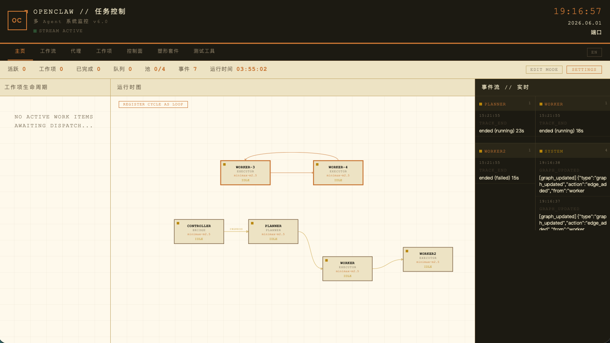
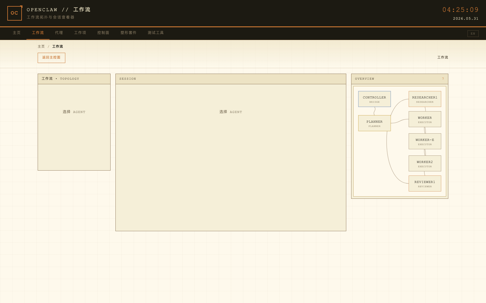

<div align="center">

# MultiAgent-OpenClaw-System-kksl

**多 Agent 协作平台 —— 代码控制流程，LLM 负责内容。**

[](https://github.com/Hakens12025/openclaw-multiagent)
[](https://github.com/Hakens12025/openclaw-multiagent)
[](https://nodejs.org/)

[快速开始](#快速开始) · [它能做什么](#它能做什么) · [它怎么工作](#它怎么工作) · [文档](#文档)

</div>

---

把多个 LLM agent 放进同一个工作空间，用一条传送带让它们协作：每个 agent 读自己的 inbox、处理、写 outbox 然后停下，平台按 graph 授权把产物投递给下一个 agent。换一套拓扑只改 JSON 配置，平台代码一行不动。

> 个人研究项目，还在持续演进。核心（inbox/outbox + graph 调度）稳定可用，日常在 macOS 上跑。想一起折腾 agent 架构的，欢迎 star / 提 issue。

## 快速开始

```bash
git clone https://github.com/Hakens12025/openclaw-multiagent.git ~/.openclaw
cd ~/.openclaw
cp openclaw.example.json openclaw.json   # 填模型 API key 和 gateway token
bash setup.sh
bash start.sh
```

打开 `http://localhost:18789/watchdog/progress?token=<你的 token>` 就是 Dashboard。

需要 Node 22+ 和 `openclaw` CLI（`npm install -g openclaw`）。

## 它能做什么

- **多渠道接入** —— WebUI / QQ / 飞书 / A2A 的消息进来，自动分流给合适的 agent
- **并发执行** —— worker 池默认 6 路并行，planner 拆解、worker 干活、evaluator 评估
- **研究回路** —— 一个话题自动检索、整理、评估，不达标就再来一轮，直到收敛
- **实时 Dashboard** —— SVG 拓扑看消息怎么流，session 回放看每个 agent 的输入输出，系统提示词逐层展开
- **多模型** —— ARK（豆包 / MiniMax / GLM / DeepSeek / Kimi）、OpenAI 兼容、Anthropic、本地 Ollama，配置里切
- **可扩展** —— skill 按 agent 注入，hook 拦截工具调用，改一改 graph 就是一条新工作流



> **主控面**：左侧工作项生命周期，中间实时运行时图（agent 沿 graph 边协作），右侧事件流实时滚动。



> **工作流页**：连通分量拓扑总览 + session 查看器——点任意 agent，看它这一轮的输入 → 处理过程 → 输出。

## 它怎么工作

一条原则贯穿所有设计：**代码负责流程，LLM 负责内容。**

代码管确定的事——路由、状态机、调度、安全、质量门控；LLM 管模糊的事——理解任务、产出内容、解释结论。两边互不越界。

由此长出三个核心：

- **传送带** —— graph 的边是「谁能投给谁」的授权，不是时序。agent 之间从不直接通信，全靠平台按 graph 搬运 inbox/outbox。回路里绝不硬编码 agent 名字。
- **Contract** —— 每个任务是一份合约，带着 assignee 和 replyTo，落进 agent 的 `inbox/contract.json`。
- **SOUL 通用机** —— agent 的 `SOUL.md` 只写通用行为（状态机、inbox/outbox 流程），agent有不同的Role，比如researcher、excutor、reviewer、planner、bridge。不同的Role才是各个agent的特有知识，同时可可自定义skill 注入。换个领域就是换套 Role，SOUL 一字不改。

## 设计小巧思

- 方便的WebUI，可直接管理agent（添加删除agent，prompt设计，使用的模型，agent间拓扑结构）
- 用户消息和系统内派工渠道分开，用户可以直接和系统内任意agent交流，同时可让某agent直接派工去往某个agent，或者是某个设计好的loop，完成后自动回流消息
- 用户消息和系统派工消息使用不同的prompt，系统派工prompt为专用的wake-agent-message，更加对应agent在系统中的角色
- Prompt分情况组装，skill头部强制注入上下文，记忆系统使用openclaw默认记忆系统
- 以contract为核心的session机制，同一contract在各agent之间session编号一致，便于上下文保留
- 多agent协作时，前一agent会生成context消息，以便后一agent上手开工
- harness设计为模块化，harness本身严格规范设计，倒闭operator设计和编写严格的harness模块
- 使用使用heartbeat方法避开了openclaw多并发缓慢的问题
- 设计了更好的排队系统，自动等待和自动派发更丝滑，相同contract享受相同session，同一agent再度处理该contract不会丢上下文
- 自带test-runner，3种预设test，在对系统，prompt进行修改后可直接复核质量
- 存在operator这个meta-agent，负责系统治理（修改系统agent拓扑，结构，prompt，skill，根据过往的历史运行记录自动发觉可优化的部分，张贴工单到operator页面，供用户选择），全操作使用harness和CLI system进行，无法直接edit代码，保证治理合规
- 整个结构可保存为实时预览的快照，用以预览operator对系统的修改，如有不满意可选择不应用
- 结构以保存码的形式储存，方便未来社区分享设计，分三级层次——纯编排结构、编排结构+agent内容、编排结构+agent内容+API key（用于个人结构复现）
- Token最小化为设计指导思想，不会堆prompt来限制agent的输出，极限使用过qwen3.5:0.9b模型最小上下文窗口运行该系统，简单任务依然能够跑通
- 

```
Gateway        加载 openclaw.json，注册插件
   │
Watchdog 插件   ingress 分流 · graph 调度 · loop 运行时
   │  inbox / outbox
Agent 层        每个 agent 一个 workspace，只看文件协议，不感知平台代码
```

## 文档

- **[SYSTEM_MAP.md](SYSTEM_MAP.md)** —— 10 分钟读懂全貌，从这里开始
- **[CLAUDE.md](CLAUDE.md)** —— 项目总纲：硬约束、代码红线、传送带原则
- **[SETUP.md](SETUP.md)** —— 详细安装与配置
- **[wiki/index.md](wiki/index.md)** —— 概念与架构决策索引

## 测试

```bash
cd extensions/watchdog
node test-runner.js --preset single         # 基础链路
node test-runner.js --preset concurrent      # 并发
node test-runner.js --preset research-flow   # 研究回路
```

报告写到 `~/.openclaw/test-reports/`。

---

<div align="center">

不是成熟产品，是个还在长的东西。Issue 和 PR 都欢迎。

</div>
